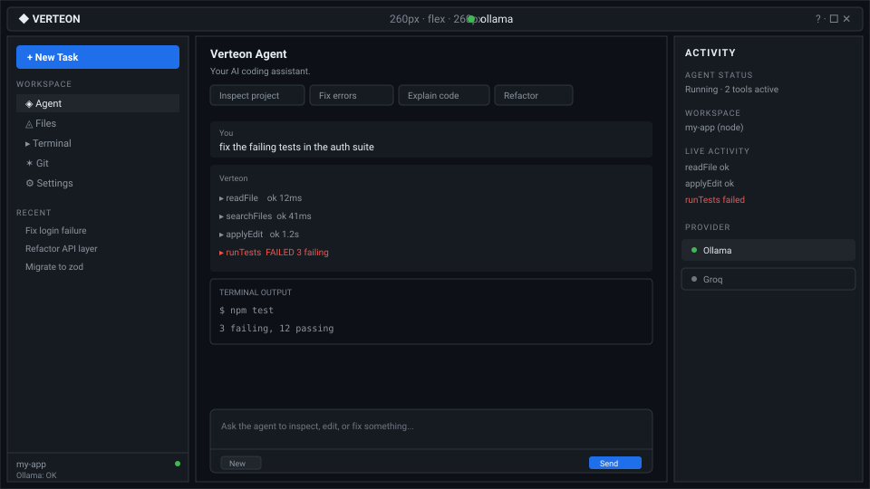
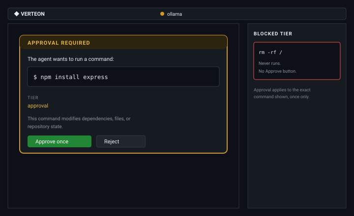

<div align="center">


# Verteon

**An agentic AI development environment that lives inside VS Code.**

Verteon inspects your project, edits files, runs commands and tests, and iterates on
failures — locally by default, with a hard approval boundary around anything risky.

[](https://code.visualstudio.com/)
[](./package.json)
[](./LICENSE.txt)

</div>

---

## Contents

- [What it does today](#what-it-does-today)
- [Quick start](#quick-start)
- [Provider setup](#provider-setup)
- [How the agent works](#how-the-agent-works)
- [Safety model](#safety-model)
- [Command reference](#command-reference)
- [Settings reference](#settings-reference)
- [Project layout](#project-layout)
- [UI wireframes](#ui-wireframes)
- [Development](#development)
- [Project status](#project-status)
- [License](#license)

---

## What it does today

Verteon is a VS Code extension that adds an AI agent workspace to the Activity Bar.

**Agent workspace**

- A three-column layout: sidebar, agent conversation, and a live activity panel.
- One composer for everything — the agent decides which tools to call for your request.
- Streaming responses rendered token-by-token from the model.
- Suggested starter prompts for the common jobs: inspect project, fix errors, explain code, refactor.
- New task / new chat control that resets the conversation without touching your code.
- Stop control that cancels the in-flight model request and kills any child processes.

**Real tools, not simulated ones**

- Filesystem: read, write, create, delete, rename, list, search by name and by content.
- Editor: get selection, get active file, get diagnostics, apply targeted edits, replace and insert text.
- Terminal: run commands, run-and-wait, spawn background processes, read output, stop processes.
- Project: detect framework, package manager, project type, workspace shape, and Git status.
- Quality: run build, run tests, run lint.
- Git (optional, `agent.enableGitTools`): status, diff, log.

**Visibility into what it is doing**

- Every tool call is reported as start / success / failure in the activity panel.
- Terminal commands and their output are captured into a browsable terminal history.
- File changes open in the native VS Code diff editor before they are applied.
- Live provider health, current model, workspace root, and Git branch with change count.

**Session continuity**

- Recent conversations are listed in the sidebar and can be reopened.
- Project memory (framework, conventions, commands that worked) persists per workspace.
- Conversations are stored locally; nothing is uploaded anywhere except to the provider you select.

**Privacy**

- Local models via Ollama are the default — no API key required.
- Cloud provider keys are stored in VS Code's secret storage when available, and are never sent
  to the webview, logs, or conversation history.

---

## Quick start

**Requirements**

- VS Code `1.85.0` or newer
- [Ollama](https://ollama.com) running locally (default `http://localhost:11434`)
- A pulled coding-capable model, for example:

```bash
ollama pull qwen2.5-coder:7b
```

**Run from source**

```bash
npm install
npm run build
```

Then press <kbd>F5</kbd> in VS Code to launch an Extension Development Host, or package an
installable `.vsix`:

```bash
npm run package
code --install-extension local-ai-agent-0.2.0.vsix
```

**First run**

1. Open a folder — Verteon needs a workspace root to read, write, and run anything.
2. Open the **AI Agent** view from the Activity Bar.
3. The header shows a live provider status dot. If Ollama is unreachable you get a real error
   message with an *Open Settings* / *Install Ollama* shortcut — not a silent failure.
4. Ask for something, e.g. `Inspect this project and summarize its structure, framework, and how to run/test it.`

---

## Provider setup

Verteon talks to a single `AIProvider` interface, so providers are swappable without touching
the agent loop, tools, or UI.

| Provider | Status | Key required | Endpoint |
| --- | --- | --- | --- |
| **Ollama** (local, default) | Implemented | No | `http://localhost:11434` |
| **Groq** (cloud) | Implemented | Yes | `https://api.groq.com/openai/v1` |

**Ollama (default)** — set `agent.provider` to `ollama`. Nothing else to configure.

**Groq** — open the settings panel inside Verteon, switch the provider to `groq`, and paste your
key. The key is written to secret storage when the host exposes it; otherwise it falls back to
the `agent.groq.apiKey` setting. Resolution order:

1. `agent.groq.apiKey` VS Code setting, if set
2. `GROQ_API_KEY` from the workspace `.env`, then the extension folder `.env`
3. VS Code secret storage entry `agent.groq.apiKey`
4. `GROQ_API_KEY` in the process environment

Copy `.env.example` to `.env` if you prefer the file-based flow. `.env` is git-ignored and is
excluded from the packaged `.vsix`.

**Adding a provider**

1. Implement `AIProvider` (`src/types.ts`) in a new file under `src/providers/`.
2. Add the id to the `agent.provider` enum in `package.json`.
3. Add a `case` in `src/providers/providerFactory.ts`.

That is the whole integration. The loop, tools, and UI only ever see the interface.

---

## How the agent works

```
composer message
      │
      ▼
buildToolRegistry(config)          ← git tools included only when enabled
      │
      ▼
buildSystemPrompt(project, memory, activeEditor)
      │
      ▼
runAgentLoop ──► provider.chatStream ──► tool calls
      ▲                                        │
      └────────── tool results (truncated) ◄───┘
```

The loop repeats until one of four honest end states:

| Outcome | Meaning |
| --- | --- |
| `completed` | The model replied without requesting further tools. |
| `max_iterations` | `agent.maxAgentIterations` reached; the agent stops and asks how to proceed. |
| `cancelled` | You pressed Stop. The model request is aborted and child processes are killed. |
| `error` | The provider request failed; details go to the *AI Agent* output channel. |

Design rules the loop follows:

- **Bounded.** The iteration cap prevents unbounded work. Nothing retries silently forever.
- **Observable.** Every tool call emits activity before and after execution.
- **Faithful.** Tool errors are fed back to the model as errors; failures are never reported as success.
- **Reviewable.** Edits are shown in the native diff editor before they are applied.

---

## Safety model

Verteon treats the terminal as dangerous by default.

**Command classification** (`src/security/commandSafety.ts`) assigns one of three tiers:

| Tier | Behaviour | Examples |
| --- | --- | --- |
| `safe` | Runs without a prompt | `git status`, `ls`, `npm test`, `npm run build`, `tsc`, `eslint` |
| `approval` | Prompts you first | `npm install`, `git push`, `git commit`, `rm -rf ./dir`, `chmod`, `docker rm` |
| `blocked` | **Never runs.** No prompt, no override | `rm -rf /`, `mkfs`, `dd` to a raw device, fork bombs, `shutdown`, `diskpart`, `curl … \| sh` |

- **Unknown commands default to `approval`,** not to "safe". A command Verteon does not
  recognise has to be approved before it executes.
- **Approval is per exact command.** Approving `npm install express` does not authorise a
  later `npm install --force` or a `rm`.
- **`blocked` is terminal.** There is no UI path that converts a blocked command into a runnable
  one, even with approval toggles disabled.
- **Disable with awareness.** Turning off `agent.requireCommandApproval` removes the prompt for
  `approval`-tier commands only; the `blocked` tier still refuses.

**Secret hygiene** (`src/security/secretDetection.ts`)

- Reads of sensitive filenames (`.env*`, `*.pem`, `*.key`, `*.pfx`, `*.p12`, `id_rsa`,
  `id_ed25519`, `credentials.json`, `secrets.json|yaml`) are refused before the model sees them.
- File content is scanned before it leaves the machine; credentials matching AWS keys, OpenAI-style
  `sk-…`, GitHub PATs, Slack tokens, Google API keys, JWTs, and generic `api_key=`/`password=`
  assignments are replaced with `[REDACTED_SECRET]`, and the UI is told how many were redacted.
- API keys are never posted to the webview. The settings panel shows a mask, never the value.
- Verbose logging is opt-in via `agent.debugLogging`.

Redaction is deliberately conservative: a false positive is cheaper than leaking a real credential.

---

## Command reference

| Command | ID |
| --- | --- |
| AI Agent: Open | `aiAgent.open` |
| AI Agent: New Chat | `aiAgent.newChat` |
| AI Agent: Explain Selection | `aiAgent.explainSelection` |
| AI Agent: Fix Selection | `aiAgent.fixSelection` |
| AI Agent: Fix Errors | `aiAgent.fixErrors` |
| AI Agent: Refactor Selection | `aiAgent.refactorSelection` |
| AI Agent: Inspect Project | `aiAgent.inspectProject` |
| AI Agent: Stop Agent | `aiAgent.stopAgent` |
| AI Agent: Settings | `aiAgent.openSettings` |
| AI Agent: Clear Project Memory | `aiAgent.clearMemory` |
| AI Agent: Refresh Local Models | `aiAgent.refreshModels` |

Explain / Fix / Refactor also appear in the editor context menu when there is a selection.
`aiAgent.newChat` and `aiAgent.refreshModels` currently focus the view — the in-panel
**New** button and provider model refresh do the real work.

---

## Settings reference

All settings live under the `agent.*` namespace.

| Setting | Type | Default | Purpose |
| --- | --- | --- | --- |
| `agent.provider` | `ollama` \| `groq` | `ollama` | Which backend to use. Local needs no key. |
| `agent.ollama.url` | string | `http://localhost:11434` | Local Ollama base URL. |
| `agent.groq.apiKey` | string | `""` | Groq key. Prefer the in-panel secret field. |
| `agent.model` | string | `qwen2.5-coder:7b` | Model id; must exist on the selected backend. |
| `agent.temperature` | number | `0.2` | Sampling temperature (0–2). |
| `agent.maxContext` | number | `8192` | Context window requested from the model. |
| `agent.maxOutputTokens` | number | `2048` | Max tokens per model response. |
| `agent.commandTimeout` | number | `120000` | Timeout in ms for agent-run commands. |
| `agent.maxAgentIterations` | number | `5` | Cap on diagnose → fix → retry rounds. |
| `agent.requireCommandApproval` | boolean | `true` | Prompt before `approval`-tier commands. |
| `agent.requireFileApproval` | boolean | `true` | Prompt before file writes, creates, deletes, renames, edits. |
| `agent.enableProjectMemory` | boolean | `true` | Persist per-workspace memory across sessions. |
| `agent.enableGitTools` | boolean | `true` | Expose `gitStatus` / `gitDiff` / `gitLog` tools. |
| `agent.debugLogging` | boolean | `false` | Verbose logs to the *AI Agent* output channel. |

Changing provider or model re-runs the real health check, so the status dot always reflects a
live probe rather than a cached assumption.

---

## Project layout

```
src/
  extension.ts            activation, command registration, first-run health check
  types.ts                AIProvider / ToolDefinition / ActivityEvent contracts
  config/
    configuration.ts      settings resolution and Groq key lookup
  providers/
    providerFactory.ts    provider selection
    ollamaProvider.ts     local backend (/api/chat, /api/tags)
    groqProvider.ts       cloud backend (OpenAI-compatible SSE)
  agent/
    agentLoop.ts          tool-calling loop with iteration cap and cancellation
  tools/
    toolRegistry.ts       assembles the tool list from configuration
    filesystemTools.ts    read, write, create, delete, rename, list, search
    editorTools.ts        selection, diagnostics, targeted edits, insert/replace
    terminalTools.ts      command execution, process control, output capture
    projectTools.ts       framework / package manager / workspace / git detection
    testingAndGitTools.ts build, test, lint, git status, diff, log
  security/
    commandSafety.ts      safe / approval / blocked classification
    secretDetection.ts    sensitive paths and credential redaction
  context/
    contextManager.ts     system prompt, editor context, history trimming
  memory/
    memoryStore.ts        per-workspace notes and working commands
  history/
    historyStore.ts       saved conversations and the recent list
  ui/
    sidebarProvider.ts    webview host, message protocol, orchestration
    diffPreview.ts        native VS Code diff before edits land
  agents/ tasks/          reserved multi-agent and task infrastructure
media/
  icon.svg                Verteon mark
  main.css  main.js       webview styles and behaviour
test/suite/               command safety, secret detection, agent loop
docs/                     architecture, security, roadmap
```

`agents/` and `tasks/` hold storage-backed managers that are wired into the extension but not yet
surfaced in the UI. They are scaffolding, not shipped features.

---

## Development

```bash
npm install
npm run compile          # esbuild, fast dev bundle
npm run watch            # rebuild on change
npm run build            # production bundle to dist/
npm run package          # build + package .vsix
npm test                 # compile, then run the VS Code integration suite
```

The test suite covers the three areas where correctness is not negotiable: command
classification, secret redaction, and agent-loop termination.

Adding a tool: implement `ToolDefinition` in the relevant `src/tools/*.ts`, register it in
`toolRegistry.ts`, and honour the `requestApproval` / `showDiff` callbacks from the tool context.
Tools that shell out must call `classifyCommand` first — the sidebar does not classify on your behalf.

---

## UI wireframes

Full text version: [`WIREFRAME.txt`](./WIREFRAME.txt)

### Full layout



```text
+--------------------------------------------------------------------------+
| [VERTEON]                  ( ollama ) v                       [ ? ][ _ ][X] |
+--------------------------------------------------------------------------+
|            |                                        |                     |
|  SIDEBAR   |            AGENT WORKSPACE              |     ACTIVITY PANEL    |
|  260px     |            flex                       |     260px            |
|            |                                        |                     |
| +--------+ | +------------------------------------+ |  ACTIVITY            |
| |+ New   | | |  Verteon Agent                     | |  ------------------- |
| |  Task  | | |  Your AI coding assistant.         | |  AGENT STATUS       |
| +--------+ | |  [Inspect project] [Fix errors]    | |  Running - 2 tools   |
|            | |  [Explain code]    [Refactor]       | |                     |
|  WORKSPACE | |                                    | |  WORKSPACE          |
|  > Agent   | |  You: fix the failing tests       | |  my-app (node)       |
|    Files   | |                                    | |                     |
|    Terminal| |  Verteon: Running runTests...      | |  LIVE ACTIVITY      |
|    Git     | |  [diff] src/api/user.ts            | |  > readFile         |
|    Settings| |  $ npm test                        | |  > runCommand npm t |
|            | |  3 failing, 12 passing             | |  > runTests failed  |
|  RECENT    | |                                    | |                     |
|  Fix login | +------------------------------------+ |  PROVIDER           |
|    API     | | Ask the agent to inspect, edit... | |  [x] Ollama         |
| ------------| | [New]                    [Stop][Send]| |  [ ] Groq           |
| my-app     | +------------------------------------+ |                     |
| Ollama: OK |                                        |                     |
+--------------------------------------------------------------------------+
```

### Approval and the blocked tier



```text
+------------------------------------+
| APPROVAL REQUIRED                   |
| The agent wants to run a command:  |
|   $ npm install express            |
| Tier: approval                     |
| [ Approve once ]  [ Reject ]       |
+------------------------------------+

+------------------------------------+
| BLOCKED                             |
|   rm -rf /                         |
| Never runs. No Approve button.     |
+------------------------------------+
```

### Panel responsibilities

| Panel | Contains |
| --- | --- |
| **Sidebar** | New task, agent / files / terminal / git / settings views, recent conversations, workspace and provider status |
| **Main agent** | Empty state and suggestions, conversation, streaming responses, tool activity, terminal output, diff review handoff, composer |
| **Activity panel** | Agent state, workspace info, live tool feed, terminal history, provider health and switching |
| **Provider selector** | Provider choice, health dot, model refresh, live health message on change |
| **Settings** | Provider, model, iteration cap, command and file approval toggles, project memory, Groq key (masked) |

Responsive behaviour: three columns above 1000px effective width, activity collapses
into the workspace between 700 and 999px, and below 700px the sidebar and activity
become overlay drawers. The view is registered with `retainContextWhenHidden`, so
collapsing it never kills a run in progress.

---

## Project status

Verteon is under active development. Honest inventory:

**Shipped**

- Ollama (local) and Groq (cloud) providers, live health checks, model listing
- Three-column agent workspace with activity panel, terminal history, files, and git views
- 32 tools across filesystem, editor, terminal, project, build/test/lint, and git
- Three-tier command safety with a non-overridable blocked tier
- Secret redaction and sensitive-file refusal
- Native diff review before edits
- Conversation history, project memory, session restore
- Project memory stored in workspace state, conversations on disk under extension storage

**In progress / next**

- Surface the existing agent and task managers as real multi-agent sessions
- Planning panel and explicit plan/confirm step before long edit sequences
- Broader provider coverage behind the `AIProvider` interface
- Automated release packaging and versioned changelog

The UI described in `WIREFRAME.txt` is the target layout. Where it is not built yet, this README
describes what actually runs.

---

## License

Proprietary — all rights reserved. See [`LICENSE.txt`](./LICENSE.txt).

The packaged extension is currently published under the identifier `local-ai-agent`;
**Verteon** is the product name used across the UI and this repository.